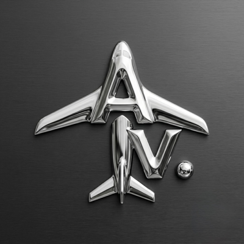

# Blog post components — drop-in snippets

Copy/paste these into a post. Every class here already exists in
`../css/style.css` — nothing new to add, nothing to import. Start a new
post by copying `how-to-read-metar-taf-reports.html` as the template,
then drop these in wherever needed.

## Flight-category chip

Inline colored badge — green/blue/red/magenta, matches the in-app VFR/
MVFR/IFR/LIFR colors exactly.

```html
<span class="cat-chip vfr">VFR</span>
<span class="cat-chip mvfr">MVFR</span>
<span class="cat-chip ifr">IFR</span>
<span class="cat-chip lifr">LIFR</span>
```

## METAR-style code block

Monospace, amber text, for showing a raw METAR/TAF string.

```html
<div class="metar-example">KJFK 221951Z 28014G22KT 10SM FEW250 24/12 A2992</div>
```

## Inline code

For a short code term inside a sentence (airport codes, single values).

```html
<code>KJFK</code>
```

## Callout box

Left-accent highlight box — use for "here's why this matters to
AvClock" tie-ins, one per post is usually enough.

```html
<div class="callout">
  <p style="margin:0;">Your callout text here.</p>
</div>
```

## Reference disclaimer

The standard closing disclaimer line every post should end with (before
"More from the blog").

```html
<p class="disclaimer">AvClock is reference and informational only, not for actual flight planning or navigation — always use official sources (FAA, NOTAMs, charts, ATC) for that.</p>
```

## Eyebrow label (category tag above the title)

```html
<div class="label-caps" style="color:var(--amber);margin-bottom:14px;">GUIDES &amp; GLOSSARY &middot; AVIATION WEATHER</div>
```

Swap the text for whatever category fits — matches the homepage's
section-eyebrow styling.

## Download CTA (centered, before "More from the blog")

Every post should end with this before the disclaimer's `more-posts`
block: a centered App Store link. Same badge markup as the homepage,
just centered and without the Mac-specific second button (one
universal listing covers both).

```html
<div style="text-align:center;margin:40px 0;">
  <div class="label-caps" style="margin-bottom:14px;">Like what you read?</div>
  <div class="badge-row" style="justify-content:center;">
    <a class="store-badge" href="https://apps.apple.com/us/app/avclock-global-airport-times/id6780675251" target="_blank" rel="noopener">
      <svg viewBox="0 0 384 512" fill="currentColor"><path d="M318.7 268.7c-.2-36.7 16.4-64.4 50-84.8-18.8-26.9-47.2-41.7-84.7-44.6-35.5-2.8-74.3 20.7-88.5 20.7-15 0-49.4-19.7-76.4-19.7C63.3 141.2 4 184.8 4 273.5q0 39.3 14.4 81.2c12.8 36.7 59 126.7 107.2 125.2 25.2-.6 43-17.9 75.8-17.9 31.8 0 48.3 17.9 76.4 17.9 48.6-.7 90.4-82.5 102.6-119.3-65.2-30.7-61.7-90-61.7-91.9zm-56.6-164.2c27.3-32.4 24.8-61.9 24-72.5-24.1 1.4-52 16.4-67.9 34.9-17.5 19.8-27.8 44.3-25.6 71.9 26.1 2 49.9-11.4 69.5-34.3z"/></svg>
      Download AvClock
    </a>
  </div>
</div>
```

## "More from the blog" footer block

Drop at the end of every post, right before `</article>`. Swap the
`href`/tag/title/excerpt per link; use `status live` for a published
post, `status soon` (with the row wrapped in a plain `<div>` instead of
`<a>`) for an unpublished stub.

```html
<div class="more-posts">
  <div class="label-caps">More from the blog</div>
  <div class="blog-board">
    <a class="blog-row" href="some-other-post.html">
      <span class="tag">TAG</span>
      <span class="row-main">
        <span class="row-title">Post title</span>
        <span class="row-excerpt">One-line excerpt.</span>
      </span>
      <span class="row-status live">LIVE</span>
    </a>
    <a class="blog-row" href="index.html">
      <span class="tag">ALL</span>
      <span class="row-main">
        <span class="row-title">See every guide</span>
        <span class="row-excerpt">Back to the full blog index.</span>
      </span>
      <span class="row-status live">&rarr;</span>
    </a>
  </div>
</div>
```

`.tag` accepts any 3-4 letter airport-board-style code — existing ones
in use: `MAC`, `ZLU`, `TAF`, `ALL`. Pick something short and relevant,
same visual language as the homepage feature-grid tags (`METAR`, `NAS`,
`ALRT`, etc.).

## App icon / brand mark

Every page's nav and footer already carry this — for a post that wants
an icon inline in body text:

```html

```

## Third-party app icon chip

For Travel Life posts mentioning a specific app, use this instead of
downloading/hosting a copy of their icon (real trademark/copyright
risk to store someone else's app icon in this repo). Pulls the icon
live from Google's public favicon service, same technique browsers and
bookmark managers use, so we're referencing their own icon, not
storing one.

```html
<div style="display:flex;align-items:center;gap:12px;margin:4px 0 18px;">
  
  <a class="store-badge secondary" href="https://EXAMPLE.com/" target="_blank" rel="noopener">Get EXAMPLE</a>
</div>
```

Swap `rel="noopener"` for `rel="sponsored noopener"` if the link is an
affiliate/referral link. For AvClock itself, use the local
`../images/app-icon.png` instead of the favicon service (it's our own
asset).

## House rules (non-negotiable, every post)

- **Never name AvClock's data providers or pipeline in body copy** (no
  "OurAirports," "NOAA," "data pipeline," etc.). That attribution lives
  only on `credits.html`, where it's legally required. Vague phrasing
  like "the underlying database" is fine if needed at all.
- **No em-dash as a mid-sentence pause or aside.** Reads as an AI
  writing tell. Use a colon, a comma, or break into two sentences. The
  only exception is the consistent "Page — AvClock" title pattern.
- **Every how-to/informational post** (anything explaining aviation
  weather, codes, procedures, etc.) needs the standard in-body
  disclaimer (see "Reference disclaimer" above) in addition to the
  site-wide footer note. Release-note/changelog posts and Travel Life
  opinion posts don't need the in-body one unless they're making a
  specific weather/flight-planning claim, but every page still carries
  the footer-wide disclaimer automatically.
- **Affiliate/referral links** need a short disclosure near the top of
  the post (see the Travel Life posts for the exact wording) — this is
  an FTC requirement, not optional styling.
- **Never publish anything that identifies the person behind AvClock**
  by name, personal email, or other personal-identifying detail. Use
  `avclock@protonmail.com` for any contact reference. If a referral
  code or similar happens to contain a name, flag it and ask rather
  than publishing it silently.

## What NOT to build a snippet for

Live/interactive things (the ticking board, the world map) only exist
on the homepage and pull from the homepage's own `<script>` block —
don't copy that JS into a post, it won't have anywhere to attach. If a
post wants to reference the live board or map, link to
`../index.html#live-board` or `../index.html#map-demo` instead of
re-implementing it.
